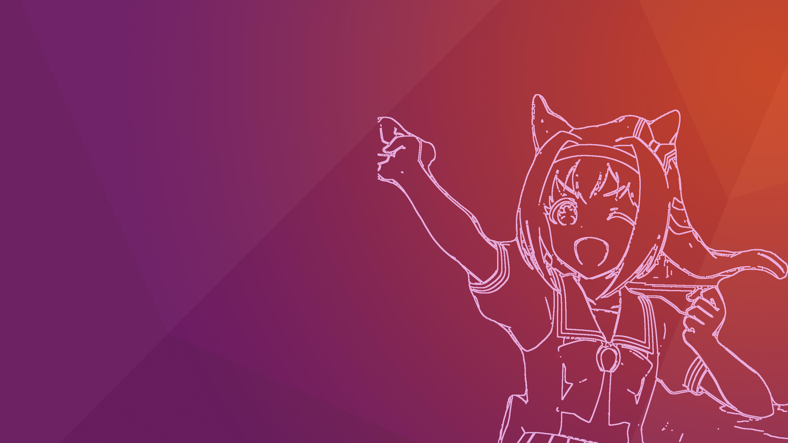
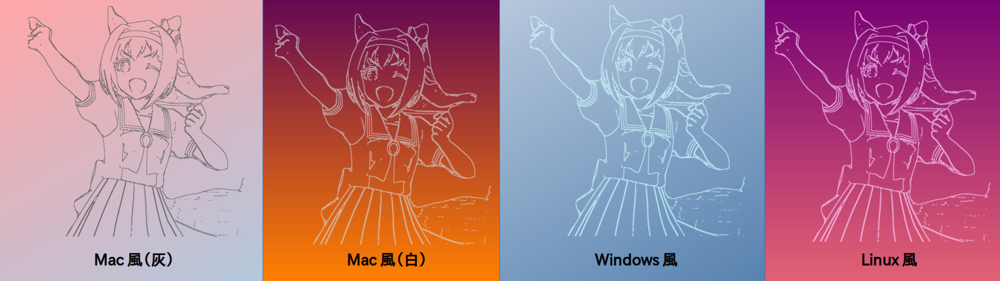

# PastePicture2Wallpaper

キャラクターをUbuntu風の壁紙に貼り付けるプログラム。



## 0. 画像を用意する

お好きな画像を用意してください。

アニメ画像などのわりと対象物と背景がはっきりしているものがおすすめです。

### StableDiffusionを使う場合

[StableDiffusion](https://github.com/AUTOMATIC1111/stable-diffusion-webui)を使用して画像を作成することができます。

#### 要件

- 8GB以上のVRAMが搭載されたGPU（Colabだとそれ以上必要な場合あり）
- Ubuntu22.04 + Python3.10環境

StableDiffusionの環境構築手順に従って環境構築してください。モデルはanything-v4.0（別途ダウンロード必須）がおすすめです。

**作成例**

- ロボットは背景と誤認されやすい。背景を生成させずに線画抽出のみにするとよい。
- 輪郭がはっきりしないパーツは欠けやすい


<br>

## 1. 画像をColabで深度画像に変換する

[PastePicture2Wallpaper.ipynb (Colaboratry)](https://colab.research.google.com/github/Ar-Ray-code/PastePicture2Wallpaper/blob/main/PastePicture2Wallpaper.ipynb)をチェックしてください。

<br>

全て実行すると線画が`result.png`という名前でそのまま出力されます。ステップ2に進んでください。

<br>

Colabでは、OSの雰囲気に合わせて線の色を変更できます。

- Mac風(灰色):パステルカラーの背景に合わせて半透明の灰色線画を出力
- Mac風(白色):鮮やかな背景に半透明の白線画を出力
- Windows風: 水色の背景にさらに明るい水色半透明の線画を出力
- Ubuntu風: 紫-桃色の背景に馴染む桃色半透明の線画を出力



<br>

<details>
<summary>画像を閾値を指定して距離を指定（出力画像がうまく深度を捉えられていない場合）</summary>

> Colabでは画像を見ながら閾値調整と確認が同時にできないので、最も下のコードセルのコメントアウトを外して`depth_result.png`をダウンロードして以下の手順を行います。

## 画像を閾値を指定して距離を指定

深度閾値が150で適当でない場合、リアルタイムで確認しながら閾値調整できます。

<br>

> PyQtの使い方下手過ぎて申し訳ないです…

[`convert.py`](./convert.py)を用いて深度の閾値を変更します。デフォルトでは150なので、そのまま`convertion`ボタンを押してもOKです。

</details>

### オプション

- `-i` : 画像パス
- `-d` : `depth_result.png`を指定

> 画像は同じサイズにしてください（何も変換しなければ問題無いです）

```bash
python3 convert.py -i ~/Downloads/image.jpg -d ~/Downloads/depth_result.png
```

変換終了後に次のファイルがコマンド入力をしたディレクトリに出力されます。

- edges_check.jpg : エッジ検出後の画像（確認用）
- edges.png : エッジ検出後の合成用画像。線に少し透明度があり、背景が透過されています。

<br>

残念ながら完璧な線画は出力できないので、適宜修正してください。

<br>

## 2. Gimpなどを使って合成

壁紙をGimpやPowerPointなどで作ってください。

- [使用した画像（StackExchange）](https://askubuntu.com/questions/1187569/where-to-find-default-ubuntu-purple-wallpaper-without-animals)


<br>

## 記事

- [2022/05/24：背景を切り抜いて線画化するプログラムで壁紙生成（PastePicture2Wallpaper）](https://ar-ray.hatenablog.com/entry/2022/05/24/070000)
- [2022/10/21：AI線画抽出を試す（Informative Drawings）](https://ar-ray.hatenablog.com/entry/2022/10/21/080000)
- [2023/03/06：新たな背景除去AIで完璧なLin(y)ux壁紙を生成する（ISNet）](https://ar-ray.hatenablog.com/entry/2023/03/06/145756)

<br>

## 参考

https://axross-recipe.com/recipes/404 by [Kazuhito00](https://github.com/Kazuhito00/)
